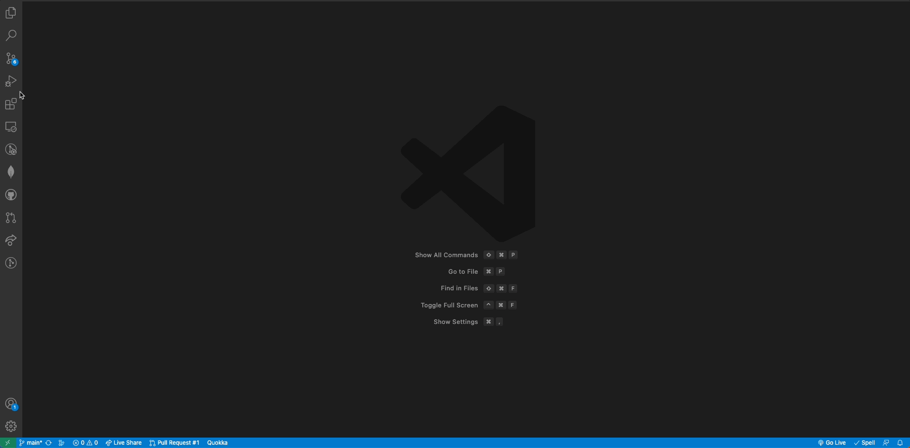
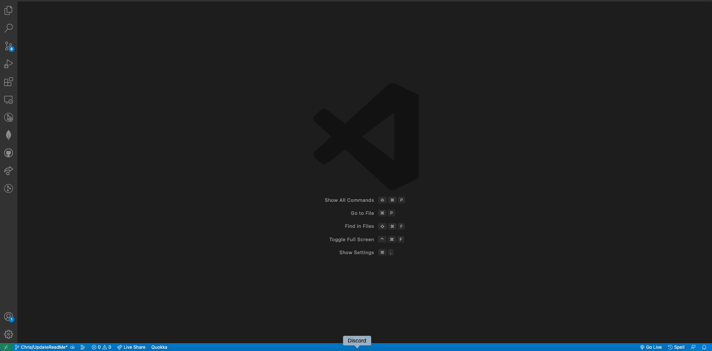
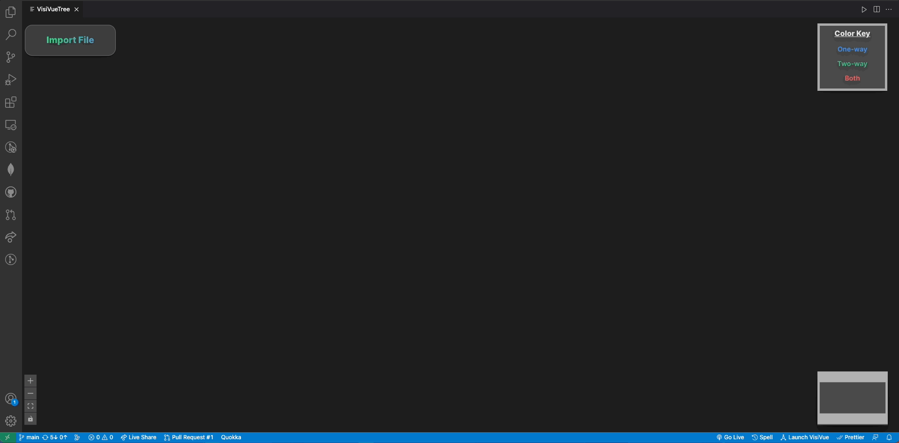

<p align=center>
    
<p>
<h1>VisiVue (Beta)</h1>
As applications built in Vue JS scale in size and complexity, developers tasked with their maintenance and management often face challenges, particularly when dealing with unanticipated side-effects caused by two-way data binding. This is where VisiVue comes in. VisiVue is a VS Code extension that aims to fulfill our mission of providing Vue developers with deeper insight into their application's structure, data flow, and state management as it scales.

<br>
<br>

<h1>With VisiVue, developers are able to:</h1>
<li>Visualize the component hierarchy of an application</li>   
<li>Keep track of stateful variables as they flow from parent to children</li>
<li>Understand what variables are <strong>one-way</strong> data bound and <strong>two-way</strong> data bound</li>  
<li>Keep track of which components these stateful variables are drilled through</li> 

<br>
<br>

<h1>Get Started</h1>

1. Head to the VS Code store and download VisiVue


<br>

2. Once installed, you may need to reload your VS Code, but next open up the command pallette by pressing "cmd + shift + p" on MacOS or "ctrl + shift + p" and click the command "Show VisiVue Panel".


<br>

3. Once you click the command in the command pallette, it will open up VisiVue! All you have to do is import the Vue file you want to visualize and you are set!


<br>

<h1>Open Source</h1>

<h3>How to Contribute</h3>

---------------------
We are looking for developers who believe in VisiVue and want to take it to the next level! Here are some features that we are currently working on implementing. Feel free to fork this repo and take a look at the source code!

<br>

Before submitting a pull request, please open an issue on our 'Issues' section.

<br>
 
| Further Features to Implement | Status |
| ------- | ------ |
| Vue Router Compatiblity | ⏳ |
| Pinia Compatibility | ⏳ |
| Testing Suites | ⏳ |
| Make the tree centered and zoomed properly on mount | ⏳ |
| Icon on each node that pulls up source code for that specific node | ⏳ |
| Compatibility with Vue applications that utilize provide/inject functions | ⏳ |


<br>
<h3>How to Run in Development Mode</h3>

---------------------

1. Clone the dev repo.
``` 
git clone https://github.com/oslabs-beta/VisiVue.git
```
2. Go into the VisiVue directory on your local machine and install dependencies
```
npm install
```
3. Once you have successfully installed dependencies, to open the developer environment for the VS Code extension, press 'ctrl + f5' if you are on Windows, or 'fn + f5' if you are on MacOS. This will open a new VS Code text editor and allow you to see a development version of the extension.

    - Note that may be difficult to get console logs when working on the Vue files specifically, so use the browser version by first checking out to the dev branch on your local machine:
    ``` 
    git checkout dev
    ```
    -Then navigate into the 'visivue-browser' directory:
    ```
    cd visivue-browser
    ```
    -And then run:
    ```
    npm run dev
    ```
    -there we have a browser version of our extension set up with nodemon

4. Once the VS Code development version is open, open the command pallete by pressing 'cmd + shift + p' and look for the command 'Show VisiVue Panel' and now you can see the extension!

    - If you are working in the VS Code developer environment, make sure to press 'cmd + r' to refresh the extension so that it compiles and runs your most recent changes.

<br>
Here are some links to documentation that you may find useful:

* <a href="https://vuejs.org/">Vue.js</a>
* <a href="https://vueflow.dev/">Vue Flow</a>
* <a href="https://code.visualstudio.com/api/references/vscode-api">VS Code Extension API</a>
* <a href="https://code.visualstudio.com/api/extension-guides/webview">Webview API</a>
* <a href="https://medium.com/@michaelbenliyan/developers-guide-to-building-vscode-webview-panel-with-react-and-messages-797981f34013">Developer's Guide to Building VSCode Webview Panel with React and Messages by Michael Mike Benliyan</a>
* <a href="https://www.typescriptlang.org/docs/">TypeScript</a>

<br>
<h1>Known Bugs</h1>
<li>
If you select a file and a tree is rendered: subsequently selecting another file  should clear the current tree and render a new tree for that new file. However, what happens is that the newly rendered tree will not have nodes, but will still persist the edges. What we suspect is happening is that Vue Flow's internal processing of our data is causing this issue. We are currently working on a fix.
</li>

<br>
<br>

<h1>Change Log</h1>
<br>
<h1>Tech Stack</h1>


<br>
<br>

<h1>VisiVue Contributors</h1>
<p dir="auto">Accelerated by <a href="https://github.com/open-source-labs">OS Labs</a> and inspired by <a href="https://reactree.dev">ReacTree</a></p>
<table>
<thead>
<tr>
<th>Name</th>
<th>GitHub</th>
<th>LinkedIn</th>
</tr>
</thead>
<tbody>
<tr>
<td><strong>Abe Henderson</strong></td>
<td><a href="https://github.com/a-hend"></a></td>
<td><a href="https://www.linkedin.com/in/abe-henderson-367638139/" rel="nofollow"></a></td>
</tr>
<tr>
<td><strong>Christopher Park</strong></td>
<td><a href="https://github.com/ChristopherPark3"></a></td>
<td><a href="https://www.linkedin.com/in/christopherjcpark/" rel="nofollow"></a></td>
</tr>
<td><strong>Kasey Nguyen</strong></td>
<td><a href="https://github.com/kaseydn"></a></td>
<td><a href="https://www.linkedin.com/in/kaseynguyen0527/" rel="nofollow"></a></td>
</tr>
<tr>
<td><strong>Ulf Wong</strong></td>
<td><a href="https://github.com/hkulf41"></a></td>
<td><a href="https://www.linkedin.com/in/ulf-wong/" rel="nofollow"></a></td>
</tr>
<tr>
<td><strong>Yosuke Tomita</strong></td>
<td><a href="https://github.com/yosuketomita"></a></td>
<td><a href="https://www.linkedin.com/in/yosuke-tomita-58617a82/" rel="nofollow"></a></td>
</tr>
<tr>
</tbody>
</table>

---


